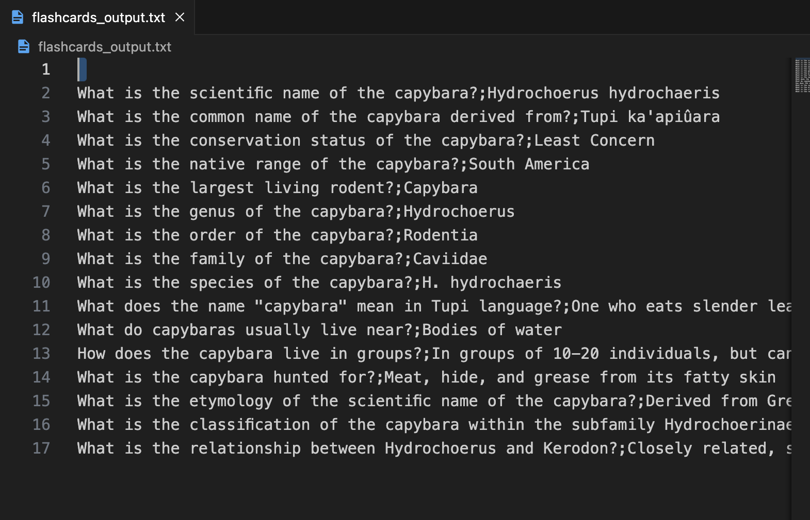
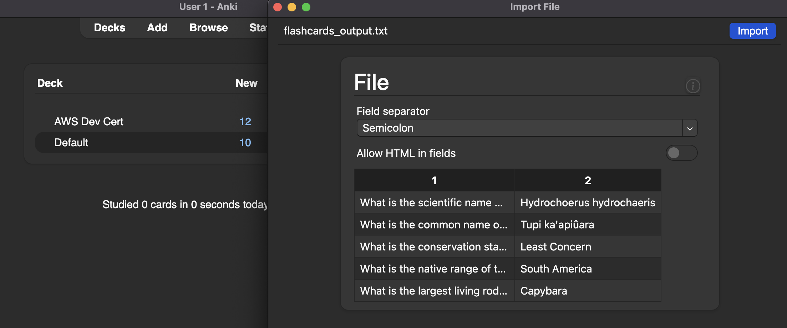

# Overview 
This script allows users to convert their notes into flashcards with ChatGPT 3.5. The flashcards are formatted to easily import into [AnkiWeb](https://ankiweb.net). 


## Basic Setup

1. Install requirements with `pip install -r requirements.txt`


2. Add your OpenAI Access Key to `.env` file.

```

OPENAI_API_KEY=<your openai api key>"

```
  - [Where do I find my API Key?](https://help.openai.com/en/articles/4936850-where-do-i-find-my-api-key)
  - Please note, OpenAI will not work until Billing is enabled on the account.

## How to Use

1. Copy notes into `flashcards_input.txt` file.

    

2. Run command `python3 create_anki_flashcards.py`. This will generate a `flashcards_export.txt` file. 
   
    

3. Import new file `flashcards_out.txt` into AnkiWeb and select file seperator by semi-colon. For more on the importing process, please see [Anki's documentation](https://docs.ankiweb.net/importing/text-files.html)

    

## TODO 
- [ ] Add commandline args to allow for different flashcard formats
- [ ] Add testing
- [ ] Turn into a Lambda function (?)